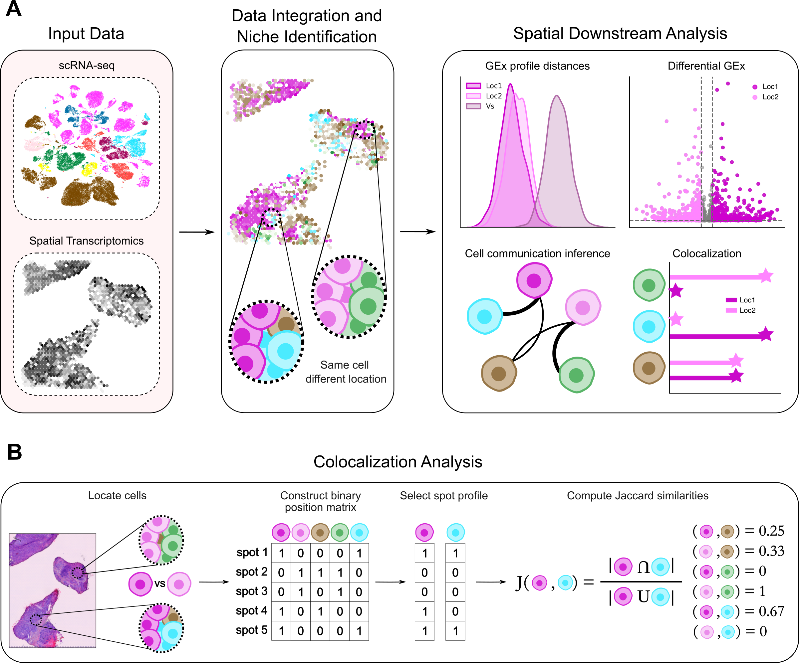
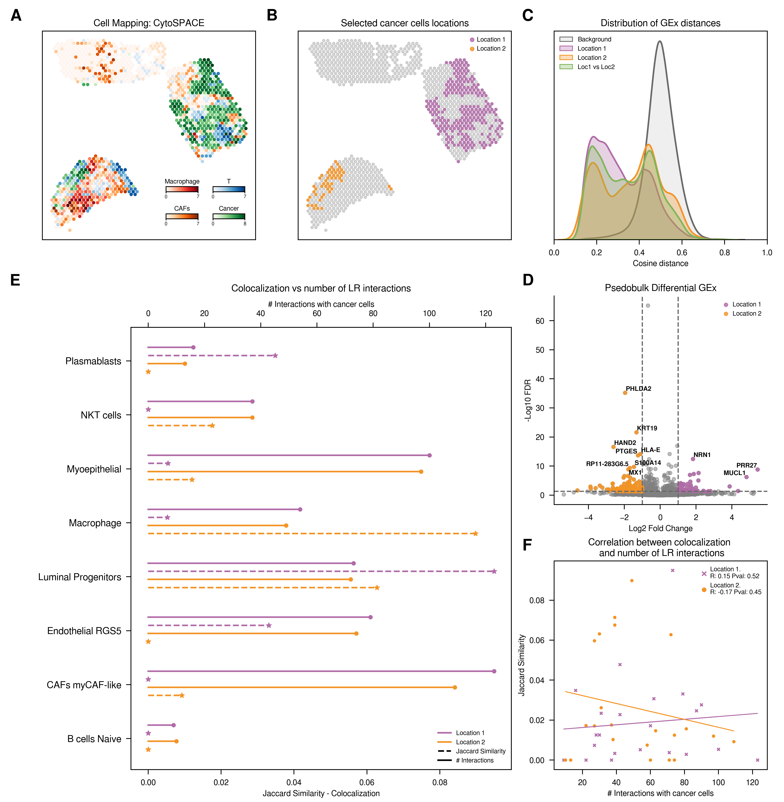

# Cell state exploration based on location and surrounding environment

In this repository, we present a systemic approach to investigate single cells within their spatial context, aiming to enhance our understanding of gene expression and communication dynamics in different niches. In summary, we first leverage existing techniques to assign spatial coordinates to individual cells, then we identify distict cellular niches with different cellular compositions and we deeper explore them to examinate how cell states are influenced by their location and surrounding microenvironment. Finally, this spatial mapping enables us to validate the accuracy of single-cell methods to predict cell-cell communication. 

To explore differences across niches, we initially investigated the overall differences between gene expression profiles among groups, comparing the distributions of pairwise cosine distances. Subsequently, we performed differential gene expression analysis between groups to identify genes whose expression is dependent on their niche. Lastly, we examined variations in cell-cell communication, correlating these with differences in cellular composition. This strategy was applied to three different datasets representing three distinct tissues: Breast cancer, mouse cortex, and human heart (case examples). 

The notebooks provided in this repository offer detailed explanations of the analyses conducted.

# Repository content 
The **repository** contains the notebooks essential for conducting the analysis discussed earlier, alongside all results showcased in the manuscript. The organization of the directories is outlined as follows:

* `1_Breast_cancer/`: This directory contains all necessary scripts and notebooks to perform the analysis on this system. Relevant data can be located at:
  - scRNA-seq: [GSE176078](https://www.ncbi.nlm.nih.gov/geo/query/acc.cgi?acc=GSE176078)
  - Spatial Transcriptomics data: [Zenodo](https://doi.org/10.5281/zenodo.4739739) 

    * `1_preproces_scanpy.ipynb`: Dataset preprocessing using the standard Scanpy pipeline.
    * `2_deconvolution_cell2loc.ipynb`: Implementation of the cell2location algorithm to deconvolve spatial transcriptomics (ST) spots.
    * `3_mapping/`: Directory containing all files necessary to run various scRNA-seq and ST integration algorithms, including CellTrek, CytoSPACE, and Tangram.
    * `4_downstream_analysis/`: Contains notebooks for performing the main analysis described in the manuscript, including:
        * Spatial mapping exploration
        * Analysis of cosine distances between gene expression profiles
        * Pseudobulk differential expression analysis 
        * Colocalization analysis
        * Cell-cell communication analysis (CellPhoneDB)
        * Correlation analysis between colocalization and cell-cell communication.
    * `5_supplementary_analysis/`: Additional analyses that support the main observations, such as:
        * Comparison of different mapping results
        * Exploration of cell type abundances by patient
        * Definition of cancer cells using UMAP
        * Re-running CellPhoneDB by subsampling to equalize cell counts by cancer cell region definition
        * Cell-cell communication analysis using LIANA (consensus score)

* `2_Mouse_brain/`: Contains scripts and notebooks for the mouse brain analysis with data sources:
  - scRNA-seq: [brain_sc.rds](https://www.dropbox.com/s/ruseq3necn176c7/brain_sc.rds?dl=0)
  - Spatial Transcriptomics data: [brain_st_cortex.rds](https://www.dropbox.com/s/azjysbt7lbpmbew/brain_st_cortex.rds?dl=0)

    * `1_mapping/`: Directory containing all files necessary to run various scRNA-seq and ST integration algorithms, including CellTrek and CytoSPACE. In `1_CellTrek_R.ipynb` we can find the Coexp analysis for finding spatial gene co-expression modules. 
    * `2_downstream_analysis/`: Contains notebooks for performing the main analysis described in the manuscript, including:
        * Spatial mapping exploration
        * Analysis of cosine distances between gene expression profiles
        * Pseudobulk differential expression analysis 
        * Colocalization analysis
        * Cell-cell communication analysis (CellPhoneDB)
        * Correlation analysis between colocalization and cell-cell communication.
    * `3_supplementary_analysis/`: Additional analyses that support the main observations, such as:
        * Definition of L5 IT neurons using UMAP
        * Re-running CellPhoneDB by subsampling to equalize cell counts by L5 IT region definition
        * Cell-cell communication analysis using LIANA (consensus score)

* `3_Heart/`: Scripts and notebooks for heart analysis are found here, with data available at [Heart Cell Atlas](https://www.heartcellatlas.org/).

    * `1_mapping/`: Directory containing all files necessary to run various scRNA-seq and ST integration algorithms, including CellTrek, CytoSPACE, and Tangram.
    * `2_downstream_analysis/`: Contains notebooks for performing the main analysis described in the manuscript, including:
        * Spatial mapping exploration
        * Analysis of cosine distances between gene expression profiles
        * Pseudobulk differential expression analysis 
        * Colocalization analysis
        * Cell-cell communication analysis (CellPhoneDB)
    * `3_supplementary_analysis/`: Additional analyses that support the main observations, such as:
        * Comparison of different mapping results
        * Exploration of cell type abundances by region (AVN or SAN)
        * Definition of Fibroblast FB4_activated using UMAP
        * Re-running CellPhoneDB by subsampling to equalize cell counts by fibroblast region definition
        * Cell-cell communication analysis using LIANA (consensus score)

* `Data/`: Input and intermediate files for all the analysis. 
* `Functions/`: Utility functions for broader analysis applications, including: 
    * `downstream_analysis.py`: Functions for main and supplementary analyses.
    * `mapping_exploration.py`: Functions dedicated to exploring scRNA-seq and ST integration results.
    * `process_visium.py`: Adaptation of Scanpy function for Visium data processing.

* `Results/`: Directory housing the outcomes of all applied methodologies.

# Download
1. Clone this repository to you local Analysis folder: 

        cd ~ && mkdir -p cell-cell-communication && cd cell-cell-communication
        git clone https://gitlabsbnb.irbbarcelona.org/epareja/cell-cell-communication.git

2. Create and activate a conda environment with all the requirements:

        conda env create --name ccc_env --file=environment.yml
        conda activate ccc_env

# Citation
'''

